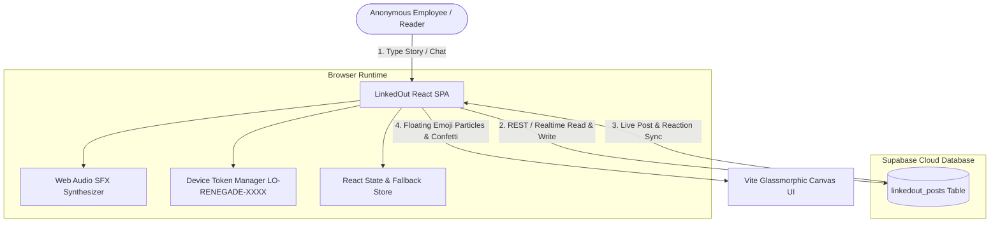
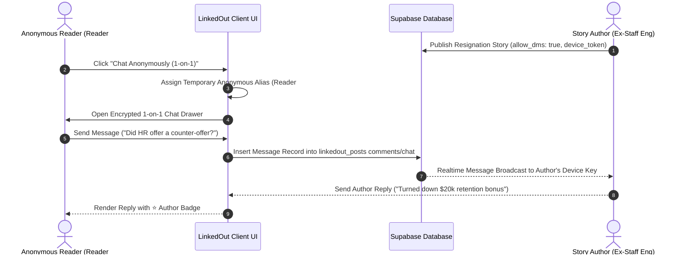

<div align="center">
  <br />
  <h1>🔥 Linked<span style="color: #ff0055;">Out</span></h1>
  <h3><i>Where employees share the real reasons they quit their toxic jobs.</i></h3>
  <p>An unfiltered, privacy-first, zero-account anti-LinkedIn platform with 1-on-1 anonymous direct chat, real-time Supabase sync, and workplace toxicity metrics.</p>

  <p>
    <a href="#-key-features">Key Features</a> •
    <a href="#-system-architecture">Architecture & Diagrams</a> •
    <a href="#-database-schema-supabase">Database Schema</a> •
    <a href="#-tech-stack">Tech Stack</a> •
    <a href="#-getting-started">Getting Started</a>
  </p>
  <br />
</div>

---

## 🌟 Overview

**LinkedOut** is a modern, privacy-focused social web application engineered for workers to anonymously share authentic, raw stories about why they left toxic work environments. By eliminating mandatory user accounts, artificial AI fluff, and corporate fake-positivity, LinkedOut provides an empowering space for real human truths, salary transparency, and peer support.

---

## ✨ Key Features

### 🚩 1. "Share Why You Left" (Primary Focus)
* **Instant Feed Publisher**: Hero story publishing box positioned right at the top of the homepage feed.
* **Authentic Story Attributes**: Post former company name (with 1-click name hiding option), role, tenure, left-behind salary package, and the exact *Final Straw* event.
* **Verified Red Flag Badges**: Categorize stories with tags like `#RTO Mandate`, `#Contract Violation`, `#90hr Weeks`, `#Hospitalization`, `#Understaffing`, `#Keystroke Tracking`.

### 🔒 2. Anonymous 1-on-1 Direct Chat System
* **End-to-End Anonymous DMs**: Connect directly with story authors to ask follow-up questions while maintaining 100% total anonymity for both sides.
* **Author DM Decision Control**: Authors choose whether to accept DMs (`🟢 DMs Open` vs `🔴 DMs Offline`).
* **Preset Follow-Up Prompts**: 1-click prompt chips to ask about counter-offers, severance, health insurance transitions, or interview experiences.

### 🔑 3. Zero-Account Device Tracking & Secret Key
* **No Account Required**: Generates an encrypted **Anonymous Secret Key** (`LO-RENEGADE-XXXX`) stored in your browser.
* **"My Stories & DMs" Dashboard**: View all stories posted from your device, manage live DM preferences, and view active 1-on-1 chats.
* **Cross-Device Secret Key Sync**: Transfer your Secret Key to any phone or computer to load your stories and DMs instantly without an email or password.

### 💬 4. Enhanced Community Comments
* **⭐ Story Author Highlight**: Replies by the original story author are highlighted with a golden `⭐ STORY AUTHOR` badge.
* **Public Comment Thread**: Drop anonymous public comments or upvote helpful advice.

### 🧮 5. Overtime & Sanity Loss Calculator
* **Interactive Workload Sliders**: Calculate your 0–100 **Toxicity Quotient**, stolen unpaid overtime value per year, and effective hourly wage.

### 🛡️ 6. Industry Red Flag Leaderboard
* **Turnover Rankings**: Track turnover statistics and common red flags across Tech & SaaS, Investment Banking, Healthcare, and Marketing Agencies.

---

## 📐 System Architecture & Diagrams

### 1. High-Level Data Flow Diagram



---

### 2. Anonymous 1-on-1 Chat Sequence Diagram



---

## 🗄️ Database Schema (Supabase)

Run this SQL snippet in your **Supabase Dashboard SQL Editor** to create the production table:

```sql
CREATE TABLE public.linkedout_posts (
  id UUID PRIMARY KEY DEFAULT gen_random_uuid(),
  author_alias TEXT NOT NULL,
  avatar TEXT,
  former_company TEXT NOT NULL,
  role TEXT,
  tenure TEXT,
  category TEXT NOT NULL,
  final_straw TEXT NOT NULL,
  content TEXT NOT NULL,
  toxic_badges JSONB DEFAULT '[]'::jsonb,
  salary_was TEXT,
  sanity_restored INT DEFAULT 95,
  allow_dms BOOLEAN DEFAULT true,
  device_token TEXT,
  reactions JSONB DEFAULT '{"fire": 1, "tea": 1, "redFlag": 0, "ripSanity": 0, "ovation": 1}'::jsonb,
  comments JSONB DEFAULT '[]'::jsonb,
  created_at TIMESTAMPTZ DEFAULT now()
);

-- Enable Row Level Security & Public Access
ALTER TABLE public.linkedout_posts ENABLE ROW LEVEL SECURITY;
CREATE POLICY "Allow public read" ON public.linkedout_posts FOR SELECT USING (true);
CREATE POLICY "Allow public insert" ON public.linkedout_posts FOR INSERT WITH CHECK (true);
CREATE POLICY "Allow public update" ON public.linkedout_posts FOR UPDATE USING (true);
```

---

## 🛠️ Tech Stack

* **Frontend Core**: React 18, Vite 6
* **Styling**: Tailwind CSS v4, Custom Dark Glassmorphism tokens (`#05070d`)
* **Database & Cloud**: Supabase JS Client (`@supabase/supabase-js`)
* **Icons & Assets**: Lucide React, Custom AI Generated Artwork
* **Interactive FX**: Web Audio API Sound Synthesizer, Canvas Confetti
* **Anonymity Engine**: LocalStorage Device Tokens & Secret Recovery Keys

---

## 🚀 Getting Started

### Prerequisites
* **Node.js**: `v18.0.0` or higher
* **npm**: `v9.0.0` or higher

### Installation

1. **Clone the repository**:
   ```bash
   git clone https://github.com/FinnSkers/LinkedOUT.git
   cd LinkedOUT
   ```

2. **Install dependencies**:
   ```bash
   npm install
   ```

3. **Configure Environment Variables**:
   Create a `.env` file in the root directory:
   ```env
   VITE_SUPABASE_URL=https://gkddsnllqwubtuoulcrh.supabase.co
   VITE_SUPABASE_ANON_KEY=sb_publishable_g2bDn-yHyZlFrqujgheO-g_yZ_TSDqV
   ```

4. **Start the Development Server**:
   ```bash
   npm run dev
   ```
   Open **`http://localhost:3000`** in your browser.

5. **Build for Production**:
   ```bash
   npm run build
   ```

---

## 📄 License
MIT License. Created for workers worldwide to reclaim professional dignity and peace of mind.
